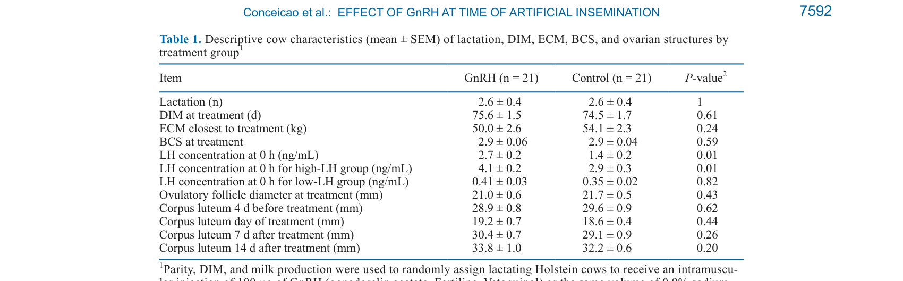
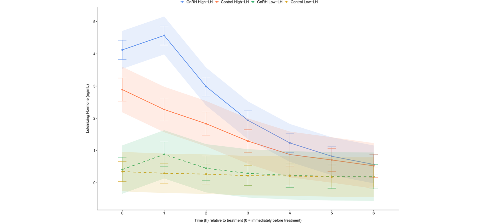
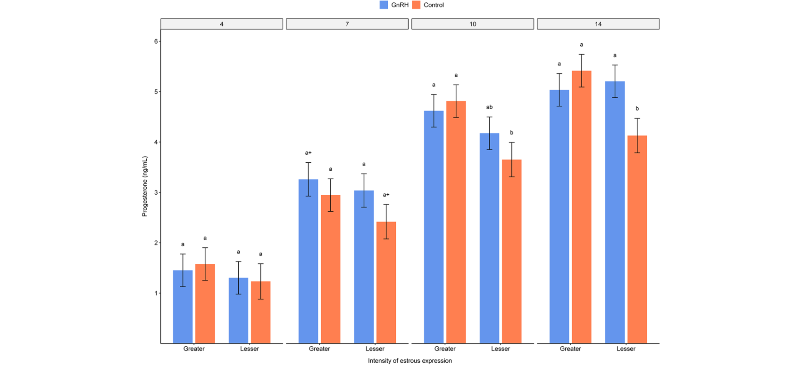

---
# YAML FRONTMATTER (обязательно)
id: CS.SOTA.363
type: sota
format_version: v1.1
knowledge_tier: P2
domain: cattle-science
area: reproduction
subarea: estrus-detection
subarea2: gnrh-at-ai
category: field-study
year: 2026
authors: "Conceicao, R. S., Marques, J. C. S., Moore, S., Monteiro, P. L. J., Denis-Robichaud, J., Gomes, W. A., Burnett, T. A., Madureira, A. M. L., and Cerri, R. L. A."
title: "Effect of gonadotropin-releasing hormone administration at the supposed time of artificial insemination on luteinizing hormone and prostaglandin F2α metabolite profiles in lactating Holstein cows"
journal: "Journal of Dairy Science"
volume: "109"
issue: "7"
pages: "7587-7600"
doi: "10.3168/jds.2025-27588"
publisher: "Elsevier / ADSA"
open_access: true
license: "CC BY"
language: ru
freshness_window: "2026-07-29 — 2028-07-29"
sota_edition: "1.0"
derivation:
  - source: "Conceicao et al., 2026, Journal of Dairy Science (109:7)"
    type: "ConservativeRetextualization (FPF A.6.3)"
    reopen_trigger: "DOI: 10.3168/jds.2025-27588"
tags:
  - gnrh
  - lh
  - estrous-expression
  - automated-activity-monitor
  - progesterone
  - corpus-luteum
  - pgfm
  - holstein
related:
  - id: CS.SOTA.280
    type: complementary
    note: "Гонадорелин: доза при первой инъекции GnRH в протоколе Ovsynch (JDS, июль 2026)"
    relevance: high
  - id: CS.SOTA.XXX
    type: foundational
    note: "Burnett et al. 2022 — GnRH при ИО улучшал pregnancy per AI у коров со слабой охотой"
    relevance: high
---

# CS.SOTA.363: Conceicao et al. (2026) — Влияние введения GnRH в момент предполагаемого искусственного осеменения на профили ЛГ и метаболита простагландина F2α у лактирующих коров Holstein

> **Навигация:** [2. Аннотация](#2-аннотация-abstract) · [3. Введение](#3-введение) · [4. Методология](#4-методология) · [5. Результаты](#5-результаты) · [6. Интерпретация](#6-интерпретация-и-обсуждение) · [7. Критический анализ](#7-критический-анализ) · [8. Выводы](#8-выводы) · [9. FAQ](#9-faq) · [10. Практика](#10-практическое-применение) · [12. Источники](#12-источники)

---

# 2. АННОТАЦИЯ (Abstract)

## 2.1. Перевод Abstract

Целью исследования была оценка связи между введением GnRH в предполагаемый момент искусственного осеменения (ИО) и циркулирующими концентрациями ЛГ у лактирующих коров Holstein, а также изучение того, модулирует ли интенсивность проявления охоты эту связь. Дополнительно оценивалось влияние введения GnRH на способность матки продуцировать 13,14-дигидро-15-кето-простагландин F2α (PGFM) на 16-й день полового цикла и связь обработки с концентрациями прогестерона (P4) после овуляции. Всего 42 лактирующие коровы прошли протокол синхронизации Ovsynch. УЗИ яичников и пробы крови оценивались на 7 и 14 день после синхронизации и ежедневно до выявления спонтанной охоты. При выявлении спонтанной охоты коровы были распределены для получения либо 100 мкг GnRH (обработка), либо эквивалентного объёма 0.9% раствора натрия хлорида (контроль) в предполагаемый момент ИО. Пробы крови собирались непосредственно перед обработкой (0 ч) и с интервалом 1 ч в течение следующих 6 ч для оценки концентраций ЛГ. Последующие УЗИ проводились через 24 ч, 48 ч, 7 и 14 дней для подтверждения овуляции и оценки развития жёлтого тела (CL). Диаметры CL и его полости использовались для расчёта общего объёма CL, а пробы крови собирались для измерения P4 плазмы на 4, 7, 10 и 14 день после охоты. Подгруппа коров (GnRH: n = 14; контроль: n = 14) прошла эстрадиол-окситоциновый тест на 16-й день после охоты для оценки высвобождения PGFM. Обработка влияла на концентрации ЛГ; однако этот эффект зависел от исходной концентрации ЛГ. Коровы были разделены по медиане ЛГ на 0 ч (0.81 нг/мл) на группы высокого и низкого ЛГ. У коров с высоким ЛГ обработанные GnRH имели большие концентрации ЛГ на 1 ч (GnRH: 4.6 ± 0.3 нг/мл; контроль: 2.3 ± 0.3 нг/мл) и 2 ч (GnRH: 3.0 ± 0.3 нг/мл; контроль: 1.8 ± 0.3 нг/мл) по сравнению с контролем. Интенсивность охоты не модулировала ответ ЛГ, но было взаимодействие между обработкой и интенсивностью охоты на объём CL и концентрации P4 после охоты. Эта связь была более выражена на 14-й день после охоты, где контрольные коровы со слабой интенсивностью охоты имели меньший объём CL и более низкую концентрацию P4, чем коровы с высокой интенсивностью охоты и GnRH-обработанные коровы со слабой интенсивностью (GnRH-высокая: 5.0 ± 0.3 нг/мл; контроль-высокая: 5.4 ± 0.3 нг/мл; GnRH-слабая: 5.2 ± 0.3 нг/мл; контроль-слабая: 4.1 ± 0.3 нг/мл). GnRH-обработанные коровы также имели тенденцию к большим концентрациям PGFM по сравнению с контролем (GnRH: 110.7 ± 9.2 пг/мл; контроль: 86 ± 9.2 пг/мл). В заключение, введение GnRH в предполагаемый момент ИО увеличивало циркулирующую концентрацию ЛГ, хотя остаётся неясным, достаточно ли этого увеличения для влияния на исходы фертильности. Более того, интенсивность охоты, по-видимому, модулировала эффект GnRH на развитие CL и концентрацию P4 после охоты.

## 2.2. Key Claims

**Claim 1: GnRH в момент ИО увеличивает ЛГ, но эффект зависит от исходной концентрации ЛГ.**
- **Утверждение:** Эффект GnRH на ЛГ наблюдался только у коров с высокой исходной концентрацией ЛГ (>0.81 нг/мл): на 1 ч 4.6 против 2.3 нг/мл, на 2 ч 3.0 против 1.8 нг/мл. У коров с низким исходным ЛГ эффекта не было.
- **Evidence:** РКИ, 42 коровы (21/21); смешанные модели с исходным ЛГ как ковариатой; P < 0.01.
- **Уверенность:** 0.82 (РКИ, но дисбаланс исходного ЛГ между группами осложняет интерпретацию).
- **Цитата:** "Treatment influenced LH concentrations; however, this effect was dependent on the initial LH concentration." (Conceicao et al., 2026, p. 7587)

**Claim 2: Интенсивность охоты НЕ модулирует ответ ЛГ на GnRH.**
- **Утверждение:** Взаимодействия между интенсивностью охоты (пик активности по AAM) и обработкой GnRH на концентрации ЛГ не выявлено (P = 0.40).
- **Evidence:** Анализ взаимодействия в смешанных моделях; пик активности как ковариата.
- **Уверенность:** 0.78 (прямой тест взаимодействия; ограниченная мощность).
- **Цитата:** "Estrous intensity did not modulate the LH response." (Conceicao et al., 2026, p. 7587)

**Claim 3: GnRH компенсирует слабую охоту по объёму CL и P4 на 14-й день (exploratory).**
- **Утверждение:** Контрольные коровы со слабой интенсивностью охоты имели меньший объём CL и P4 на 14 день (4.1 нг/мл), тогда как GnRH-обработанные со слабой охотой достигали уровней коров с высокой охотой (5.2 нг/мл против 5.0–5.4 нг/мл).
- **Evidence:** Значимое взаимодействие обработка × интенсивность охоты на объём CL (7 и 14 д) и P4 (10 и 14 д); P < 0.05.
- **Уверенность:** 0.65 (exploratory-анализ, малые подгруппы n ≈ 10, требует репликации).
- **Цитата:** "...control cows with lesser estrous intensity had smaller CL volume and lower P4 concentration than cows with greater estrous intensity and GnRH-treated cows with lesser intensity of estrus." (Conceicao et al., 2026, p. 7587)

**Claim 4: GnRH имеет тенденцию к увеличению PGFM после эстрадиол-окситоцинового теста.**
- **Утверждение:** GnRH-обработанные коровы имели тенденцию к большим концентрациям PGFM (110.7 против 86 пг/мл, P = 0.07); на 90 минуте разница +44 ± 18 пг/мл (P = 0.02).
- **Evidence:** Эстрадиол-окситоциновый тест на 16 день после охоты (n = 14/14).
- **Уверенность:** 0.60 (тенденция, незначимый основной эффект; биологическая значимость сомнительна по оценке самих авторов).
- **Цитата:** "The GnRH-treated cows also tended to have greater PGFM concentrations compared with control." (Conceicao et al., 2026, p. 7587)

---

# 3. ВВЕДЕНИЕ

## 3.1. Контекст и значимость проблемы

Автоматические мониторы активности (AAM) — устойчивая опция для молочных ферм: позволяют поддерживать воспроизводительную эффективность при снижении использования гормонов. Интенсивность охоты, измеренная AAM, положительно связана с pregnancy per AI, частотой овуляций, жизнеспособностью эмбрионов и снижением потерь беременности. Введение GnRH в момент ИО при спонтанной охоте — распространённая практика, но её эффективность, по данным последних исследований, может зависеть от интенсивности охоты: Burnett et al. (2022) показали улучшение pregnancy per AI у коров со слабой охотой, тогда как Hubner et al. (2022) эффекта не нашли. Физиологический механизм этого расхождения неясен.

## 3.2. Обзор литературы (краткий)

1. **Burnett et al. (2018)** — связь интенсивности охоты с таймингом и неудачей овуляции (AAM).
2. **Madureira et al. (2019, 2020)** — интенсивность охоты и фертильность/жизнеспособность эмбрионов.
3. **Burnett et al. (2022)** — GnRH при ИО улучшал зачатие у коров со слабой охотой.
4. **Hubner et al. (2022)** — отсутствие эффекта GnRH при ИО на pregnancy per AI (контрпример).
5. **Hassanein et al. (2024a, 2024b)** — обзоры роли GnRH и его агонистов в репродукции КРС.

## 3.3. Гипотеза и цель исследования

**Гипотеза:** Коровы, обработанные GnRH, будут иметь большие концентрации ЛГ, и интенсивность охоты будет связана с эффектом GnRH на продукцию ЛГ; также GnRH повлияет на секрецию PGFM после эстрадиол-окситоцинового теста и на концентрации P4.

**Цель:** Оценить связь между введением GnRH в предполагаемый момент ИО и циркулирующими концентрациями ЛГ; изучить модуляцию интенсивностью охоты; оценить эффект на PGFM (16 день цикла) и P4 после овуляции.

**Primary outcomes:** Концентрации ЛГ в течение 6 ч после обработки; PGFM после эстрадиол-окситоцинового теста.
**Secondary outcomes:** Объём CL и концентрации P4 на 4, 7, 10, 14 день после охоты.

---

# 4. МЕТОДОЛОГИЯ

## 4.1. Дизайн исследования

| Параметр | Описание |
|----------|----------|
| **Тип исследования** | Рандомизированное контролируемое исследование (РКИ) |
| **Место** | UBC Dairy Education and Research Centre, Agassiz, Канада; август–декабрь 2021 |
| **Животные** | 63 лактирующие коровы Holstein включено; 42 рандомизированы (GnRH: n = 21, контроль: n = 21) |
| **Синхронизация** | Ovsynch с CIDR (GnRH 100 мкг + P4-имплант 7 д; PGF2α при снятии; GnRH через 56 ч) |
| **Обработка** | 100 мкг GnRH (гонадорелина ацетат, Fertiline) в/м против 2 мл 0.9% NaCl в предполагаемый момент ИО (правило a.m./p.m.) |
| **Мониторинг ЛГ** | Пробы крови 0 ч и ежечасно 6 ч; радиоиммуноанализ (чувствительность 0.05 нг/мл) |
| **Мониторинг CL/P4** | УЗИ 24 ч, 48 ч, 7, 14 д; P4 на 4, 7, 10, 14 д (ELISA) |
| **PGFM-тест** | Эстрадиол-ципионат 1.0 мг в/м за 4 ч + окситоцин 100 МЕ в/в на 16 день; пробы −15 мин до 180 мин (подгруппа n = 14/14) |
| **AAM** | AfiPedometer Plus (AfiMilk), почасовая активность; пик активности как мера интенсивности охоты (медиана 387 activity-index) |
| **Статистика** | SAS Studio (PROC MIXED, авторегрессионная ковариация, повторные измерения); исходный ЛГ как ковариата; значимость P ≤ 0.05, тенденции P < 0.10 |

## 4.2. Медиа-инвентарь

| ID | Тип | Описание | Файл | Статус |
|----|-----|----------|------|--------|
| Table 1 | Таблица | Описательные характеристики коров по группам (лактация, DIM, ECM, BCS, ЛГ, структуры яичников) | `table-1-descriptive.png` | ✅ Встроено |
| Fig. 3 | График | Концентрации ЛГ во времени по обработке и категории исходного ЛГ (high/low) | `figure-3-lh-by-initial-lh.png` | ✅ Встроено |
| Fig. 6 | График | Концентрации P4 на 4, 7, 10, 14 день по обработке и интенсивности охоты | `figure-6-p4-by-estrous-intensity.png` | ✅ Встроено |

---

# 5. РЕЗУЛЬТАТЫ

## 5.1. Описательная статистика

**Соответствует:** Table 1

*Источник: Conceicao et al., 2026, p. 7592 (Table 1).*

**Описание:**
Из 63 включённых коров 11 не овулировали после синхронизации, 6 имели «тихую» охоту, 4 — ложноположительный алерт AAM; итого 42 коровы рандомизированы (21/21). Группы не различались по лактации, DIM, ECM, BCS, диаметру овуляторного фолликула и CL. Однако концентрация ЛГ на 0 ч была выше в группе GnRH (2.7 ± 0.2 против 1.4 ± 0.2 нг/мл; P = 0.01) — случайный дисбаланс, учтённый ковариатой. Интервал от начала охоты до обработки: 8.6 ± 0.3 ч (GnRH) против 11.2 ± 0.2 ч (контроль).

## 5.2. Эффект GnRH на профиль ЛГ

**Соответствует:** Figure 3

*Источник: Conceicao et al., 2026, p. 7594 (Figure 3).*

**Описание:**
При контроле исходного ЛГ как непрерывной ковариаты GnRH-обработанные коровы имели больший ЛГ на 1 ч (2.9 ± 0.2 против 1.4 ± 0.2 нг/мл; P < 0.01) и тенденцию на 2 ч (1.7 ± 0.2 против 1.2 ± 0.2 нг/мл; P = 0.09); различий после 3 ч не было. Эффект проявился только в подгруппе high-LH: 1 ч — 4.6 ± 0.3 против 2.3 ± 0.3 нг/мл (P < 0.01); 2 ч — 3.0 ± 0.3 против 1.8 ± 0.3 нг/мл (P < 0.01). В подгруппе low-LH различий не было (P = 0.72). Взаимодействия интенсивности охоты с обработкой на ЛГ не выявлено (P = 0.40).

## 5.3. Эффект GnRH на профиль PGFM

**Описание:**
Общие концентрации PGFM после эстрадиол-окситоцинового теста имели тенденцию к увеличению у GnRH-группы (110.7 ± 9.2 против 86 ± 9.2 пг/мл; P = 0.07). Выявлено взаимодействие обработки и времени: на 90-й минуте разница составила +44 ± 18 пг/мл (P = 0.02); остальные точки не различались. Интенсивность охоты (P = 0.68) и P4 на 14 день (P = 0.95) не влияли на PGFM-ответ.

## 5.4. Объём CL и P4 по интенсивности охоты (exploratory)

**Соответствует:** Figure 6

*Источник: Conceicao et al., 2026, p. 7598 (Figure 6).*

**Описание:**
Значимое взаимодействие обработка × интенсивность охоты на объём CL (7 и 14 д) и P4. На 14 день контрольные коровы со слабой охотой имели меньший объём CL и более низкий P4 (4.1 ± 0.3 нг/мл), чем коровы с высокой охотой (контроль: 5.4 ± 0.3; GnRH: 5.0 ± 0.3 нг/мл) и чем GnRH-обработанные со слабой охотой (5.2 ± 0.3 нг/мл; P < 0.05). То есть GnRH «выравнивал» P4 коров со слабой охотой до уровня коров с высокой охотой.

---

# 6. ИНТЕРПРЕТАЦИЯ И ОБСУЖДЕНИЕ

## 6.1. Связь с гипотезой

Гипотеза подтверждена частично. GnRH действительно увеличивал ЛГ, но эффект был транзиторным и зависел от исходного ЛГ; интенсивность охоты НЕ модулировала ответ ЛГ (опровержение второй части гипотезы). Неожиданный результат — положительный эффект GnRH на объём CL и P4 именно у коров со слабой охотой (exploratory).

## 6.2. Сравнение с литературой

| Исследование | Согласие/Противоречие/Расширение |
|--------------|----------------------------------|
| Burnett et al. (2022) | **Расширяет** — даёт физиологическое объяснение (CL/P4) улучшения зачатия у коров со слабой охотой |
| Hubner et al. (2022) | **Согласуется** — слабый/отсутствующий эффект GnRH на ЛГ-ответ при спонтанной охоте |
| Giordano et al. (2012) | **Согласуется** — экзогенный GnRH-индуцированный подъём ЛГ слабее эндогенного |
| Aungier et al. (2015) | **Согласуется** — эндогенный всплеск ЛГ начинается до алерта AAM (~14 ч), что объясняет надир ЛГ к моменту обработки |
| Larson et al. (1997); Cuevas-Gómez et al. (2025) | **Согласуется** — разница P4 ~1.5 нг/мл на 14 день может быть связана с исходами беременности |

## 6.3. Механистические выводы

1. **Транзиторность ответа ЛГ:** Обработка проводилась после пика эндогенного всплеска ЛГ; пул ЛГ в гипофизе частично истощён, поэтому ответ (~1.5 нг/мл) мал по сравнению с эндогенным всплеском (8–14 нг/мл) и, вероятно, биологически незначим для фертильности напрямую.
2. **Возможный прямой эффект на лютеинизацию:** GnRH-рецепторы обнаружены в гранулёзных клетках яичника; GnRH может усиливать активность P450scc/StAR, мобилизацию холестерина и дифференцировку в лютеиновые клетки — поддержка развития CL и продукции P4 (особенно у коров со слабой охотой с субоптимальным гормональным профилем).
3. **PGFM:** Увеличение PGFM после теста отражает отзывчивость эндометрия, но не обязательно риск преждевременной лютеолизиса; значения сопоставимы с high-P4 условиями по Cerri et al. (2011) и вряд ли биологически значимы.
4. **Окно чувствительности:** Возможно существует чувствительное окно тайминга GnRH относительно начала охоты; введение ближе к началу охоты (конкурентно с эндогенным всплеском) могло бы дать больший ответ.

---

# 7. КРИТИЧЕСКИЙ АНАЛИЗ

## 7.1. Сильные стороны

- **РКИ с блочной рандомизацией** по паритету, DIM и удою; персонал фермы ослеплён.
- **Частый гормональный сэмплинг** (ежечасно 6 ч для ЛГ; 8 точек для PGFM).
- **Объективная мера охоты** (AAM) вместо визуального выявления.
- **Учёт дисбаланса:** исходный ЛГ включён ковариатой + sensitivity-анализ без верхнего квартиля.
- **Физиологическая глубина:** связка ЛГ → CL/P4 → PGFM в одном дизайне.

## 7.2. Ограничения

**Внутренние:**
- **Дисбаланс исходного ЛГ:** Случайно больше коров с высоким ЛГ попало в GnRH-группу (2.7 против 1.4 нг/мл, P = 0.01) — осложняет причинную интерпретацию.
- **Малый размер выборки** для exploratory-подгрупп (n ≈ 10 на ячейку).
- **Неполное сокрытие аллокации** от части исследовательской команды.
- **Множественные сравнения** без формальной коррекции.

**Внешние:**
- **Одно стадо, один сезон** — ограниченная генерализуемость.
- **Фертильность не оценивалась** (pregnancy per AI не измерялся) — физиологические ответы нельзя напрямую связать с репродуктивной эффективностью.
- **Эстрадиол-окситоциновый тест** оценивает отзывчивость эндометрия, а не эндогенную пульсатильную каскаду PGF2α.

## 7.3. Применимость к российским условиям

- **AAM в России:** Системы мониторинга активности (AfiMilk, DeLaval, SCR) внедрены на крупных российских комплексах; подход «таргетного GnRH» по данным AAM напрямую переносим.
- **Практическая осторожность:** Рутинное введение GnRH при ИО всем коровам со спонтанной охотой не подкреплено эффектом на ЛГ; потенциальная польза — только для коров со слабой охотой (через поддержку CL/P4).
- **Экономика:** Отказ от массового применения GnRH в пользу таргетного снижает затраты на гормоны и труд — согласуется с трендом targeted reproductive management (Gonzalez et al., 2023; Chebel et al., 2025).

---

# 8. ВЫВОДЫ

## 8.1. Ключевые выводы автора (перевод)

Введение GnRH в предполагаемый момент ИО влияло на концентрации ЛГ, причём величина ответа зависела от исходного ЛГ-профиля коровы. Интенсивность охоты не модулировала ответ ЛГ на GnRH. GnRH имел тенденцию к умеренному увеличению PGFM после эстрадиол-окситоцинового теста, биологическая значимость которого неясна. Exploratory-анализ показал, что контрольные коровы со слабой интенсивностью охоты имели меньший объём CL и более низкие концентрации P4, чем коровы с высокой интенсивностью независимо от группы.

## 8.2. Ключевые выводы (структурировано)

1. **Ответ ЛГ на GnRH зависит от исходного ЛГ** — эффект только у коров, предположительно ещё в фазе эндогенного всплеска (high-LH).
2. **Интенсивность охоты НЕ модулирует ЛГ-ответ** — механизм преимущества GnRH у коров со слабой охотой лежит не на уровне ЛГ.
3. **GnRH выравнивает CL/P4 у коров со слабой охотой** до уровня коров с высокой охотой к 14 дню (exploratory, требует репликации).
4. **Транзиторное увеличение PGFM** — вероятно, без биологической значимости для лютеолизиса.
5. **Массовое применение GnRH при ИО не обосновано** — потенциальная ниша: таргетное применение по данным AAM.

## 8.3. Ключевые сообщения для лекции

1. Эндогенный всплеск ЛГ обычно начинается ДО алерта AAM — к моменту ИО пул ЛГ частично истощён, и экзогенный GnRH даёт лишь ~1.5 нг/мл против 8–14 нг/мл эндогенного всплеска.
2. Польза GnRH при ИО для коров со слабой охотой, похоже, реализуется через поддержку жёлтого тела и P4, а не через ЛГ.
3. Разница P4 ~1 нг/мл на 14 день (4.1 против 5.0–5.4 нг/мл) — тот порядок величины, который в литературе связывают с исходами беременности.
4. Данные AAM позволяют перейти от массовых гормональных протоколов к таргетным вмешательствам.

---

# 9. FAQ

**Вопрос 1: Стоит ли вводить GnRH всем коровам при ИО по спонтанной охоте?**
Ответ: По данным этого исследования — нет. Увеличение ЛГ транзиторно и вероятно биологически незначимо; эффект на фертильность в работе не оценивался. Потенциальная польза показана только для подгруппы со слабой охотой (через CL/P4) и требует подтверждения на исходах беременности.

**Вопрос 2: Почему эффект GnRH на ЛГ проявился только у high-LH коров?**
Ответ: У большинства коров к моменту обработки ЛГ был в надире — эндогенный всплеск уже завершался, пул ЛГ в гипофизе истощён. У high-LH коров всплеск ещё продолжался, и экзогенный GnRH поддерживал/усиливал его на 1–2 ч.

**Вопрос 3: Как GnRH может улучшать P4, не влияя на ЛГ значимо?**
Ответ: Гипотеза авторов — прямой эффект на яичник: GnRH-рецепторы в гранулёзных клетках могут усиливать стероидогенез (P450scc, StAR) и лютеинизацию. Механизм спекулятивен, требует прямых исследований экспрессии GnRHR.

**Вопрос 4: Опасно ли увеличение PGFM для сохранения беременности?**
Ответ: Маловероятно. Увеличение транзиторно, значения (110.7 пг/мл) сопоставимы с high-P4 условиями и в разы ниже low-P4 (375.5 пг/мл) по Cerri et al. (2011); тест отражает отзывчивость эндометрия, а не запуск лютеолизиса.

**Вопрос 5: Что нужно исследовать дальше?**
Ответ: (1) Точный тайминг GnRH относительно начала охоты (окно чувствительности); (2) экспрессия GnRHR в гранулёзных/лютеиновых клетках у коров с разной интенсивностью охоты; (3) эффект на P4 после 10 дня цикла и на pregnancy per AI при таргетном применении; (4) репликация на больших выборках и нескольких стадах.

---

# 10. ПРАКТИЧЕСКОЕ ПРИМЕНЕНИЕ

## 10.1. Алгоритм таргетного решения о GnRH при ИО (по данным AAM)

1. **Детекция охоты:** AAM-алерт + подтверждение (фолликул >12 мм, отсутствие CL >24 мм при УЗИ, если доступно).
2. **Оценка интенсивности:** Пик активности относительно медианы стада (в работе медиана = 387 activity-index).
3. **Решение:**
   - Высокая интенсивность → ИО без GnRH (эффекта на ЛГ нет, польза не показана).
   - Слабая интенсивность → кандидат на GnRH при ИО (потенциальная поддержка CL/P4; решение — с ветврачом, т.к. доказательства exploratory).
4. **Мониторинг:** Контроль овуляции и (при возможности) P4 на 7–14 день у коров со слабой охотой.
5. **Ревизия:** Оценка pregnancy per AI по подгруппам интенсивности каждые 3–6 месяцев.

## 10.2. Типичные ошибки

- **Рутинное введение GnRH всем коровам при ИО** — не подкреплено эффектом на ЛГ; лишние затраты.
- **Игнорирование тайминга:** Интервал охота→обработка в работе составил 4–18 ч; ответ ЛГ зависит от фазы эндогенного всплеска.
- **Интерпретация exploratory-взаимодействий как доказанных** — подгруппы по n ≈ 10 требуют репликации.
- **Ожидание эффекта на зачатие от физиологических суррогатов** — fertility-исходы в работе не измерялись.

## 10.3. Пограничные сценарии

- **Корова со слабой охотой + повторные неудачи овуляции** — наиболее вероятный бенефициар GnRH при ИО.
- **Корова с высокой интенсивностью охоты** — GnRH не нужен: ЛГ-ответа нет, CL/P4 и так на высоком уровне.
- **Ложноположительный алерт AAM** — в работе 4/63 (6%); подтверждение охоты снижает бесполезные обработки.

---

# 11. ИНСТРУМЕНТЫ И ШАБЛОНЫ

## 11.1. Ключевые числовые ориентиры

| Параметр | Значение | Комментарий |
|----------|----------|-------------|
| Медиана исходного ЛГ (0 ч) | 0.81 нг/мл | Порог разделения high/low-LH |
| Медиана пика активности | 387 activity-index (AfiActII) | Порог интенсивности охоты (стада-специфичен!) |
| Ответ ЛГ на GnRH (high-LH, 1 ч) | 4.6 vs 2.3 нг/мл | Эффект только в high-LH |
| P4 на 14 день (control-слабая охота) | 4.1 нг/мл против 5.0–5.4 нг/мл | Дефицит ~1 нг/мл — потенциально значим для беременности |
| PGFM (тенденция) | 110.7 vs 86 пг/мл | P = 0.07; значимость сомнительна |
| Доля ложных алертов AAM | 4/63 (6%) | Аргумент за подтверждение охоты |

---

# 12. ИСТОЧНИКИ

## 12.1. Первоисточник

Conceicao, R. S., Marques, J. C. S., Moore, S., Monteiro, P. L. J., Denis-Robichaud, J., Gomes, W. A., Burnett, T. A., Madureira, A. M. L., and Cerri, R. L. A. 2026. Effect of gonadotropin-releasing hormone administration at the supposed time of artificial insemination on luteinizing hormone and prostaglandin F2α metabolite profiles in lactating Holstein cows. Journal of Dairy Science 109(7):7587-7600. DOI: 10.3168/jds.2025-27588.

## 12.2. Ключевые статьи (цитированные в работе)

- Burnett, T. A., Madureira, A. M. L., Bauer, J. W., and Cerri, R. L. A. 2022. Impact of GnRH administration at the time of AI on conception risk and its association with estrous expression. J. Dairy Sci. 105:1743–1753.
- Hubner, A. M., Canisso, I. F., Peixoto, P. M., Conley, A. J., and Lima, F. S. 2022. Effect of GnRH administered at the time of AI for cows detected in estrus by conventional estrus detection or an AAM. J. Dairy Sci. 105:831–841.
- Burnett, T. A., Polsky, L., Kaur, M., and Cerri, R. L. A. 2018. Effect of estrous expression on timing and failure of ovulation of Holstein dairy cows using automated activity monitors. J. Dairy Sci. 101:11310–11320.
- Giordano, J. O., Fricke, P. M., Guenther, J. N., et al. 2012. Effect of progesterone on magnitude of the LH surge induced by two different doses of GnRH in lactating dairy cows. J. Dairy Sci. 95:3781–3793.
- Aungier, S. P. M., Roche, J. F., Duffy, P., Scully, S., and Crowe, M. A. 2015. The relationship between activity clusters detected by an automatic activity monitor and endocrine changes during the periestrous period. J. Dairy Sci. 98:1666–1684.
- Cerri, R. L. A., Chebel, R. C., Rivera, F., et al. 2011. Concentration of progesterone during the development of the ovulatory follicle: II. Ovarian and uterine responses. J. Dairy Sci. 94:3352–3365.
- Hassanein, E. M., Szelényi, Z., and Szenci, O. 2024. GnRH and its agonists in bovine reproduction I–II. Animals 14:1473; 14:1575.

## 12.3. Внешние источники [вне статьи]

- NASEM. 2021. Nutrient Requirements of Dairy Cattle. 8th rev. ed. National Academies Press. [foundational reference, не цитируется в Conceicao et al., 2026]
- Chebel, R. C., et al. 2025. Targeted reproductive management for lactating Holstein cows: Economic return. J. Dairy Sci. 108:1584–1601. [цитируется в работе; экономический контекст таргетного подхода]

---

# 13. ЖУРНАЛ ОБРАБОТКИ

## 13.1. WorkPlan

| Шаг | Действие | Статус |
|-----|----------|--------|
| 1 | Чтение полного текста PDF (14 страниц) | ✅ |
| 2 | Извлечение метаданных (авторы, DOI, страницы) | ✅ |
| 3 | Извлечение медиа (1 таблица, 2 фигуры) | ✅ |
| 4 | Анализ дизайна (РКИ, AAM, гормональный сэмплинг) | ✅ |
| 5 | Выделение Key Claims с оценкой уверенности | ✅ |
| 6 | Описание методологии (Ovsynch, a.m./p.m. правило, статистика) | ✅ |
| 7 | Детализация результатов (ЛГ, PGFM, CL/P4) | ✅ |
| 8 | Критический анализ и применимость | ✅ |
| 9 | FAQ, практическое применение, инструменты | ✅ |
| 10 | Формирование YAML frontmatter | ✅ |
| 11 | Сохранение файла | ✅ |

## 13.2. Work Record

| Параметр | Значение |
|----------|----------|
| **Время обработки** | ~35 мин |
| **Строк в файле** | ~330 |
| **Число Key Claims** | 4 |
| **Число источников** | 10 (первоисточник + 7 цитированных + 2 внешних) |
| **Число медиа** | 3 (1 таблица + 2 фигуры) |
| **FPF compliance** | A.7 (строгое разделение модели и реальности), A.6.3 (консервативная переработка), A.10 (якоря доказательств) |

---

*SoTA создан: 2026-07-29*
*Обработано по WP-86: Проверка new-articles и добавление SoTA*
