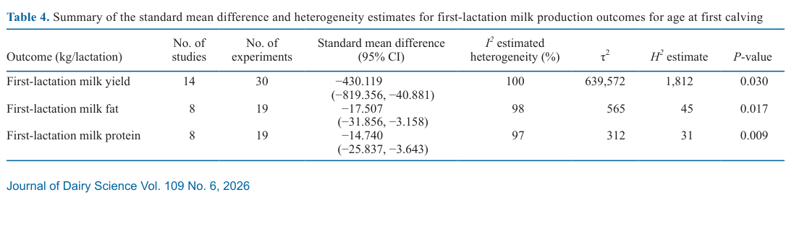
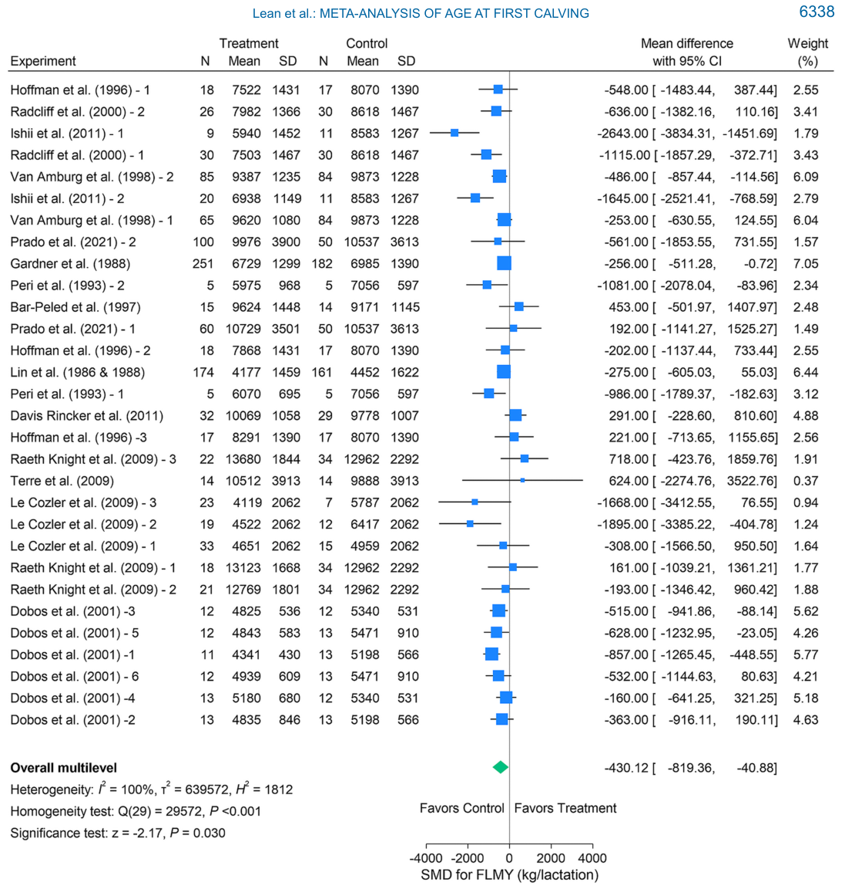
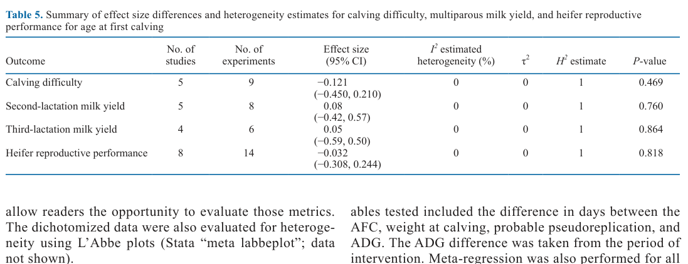
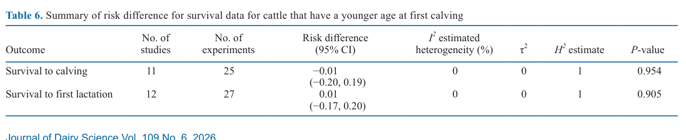
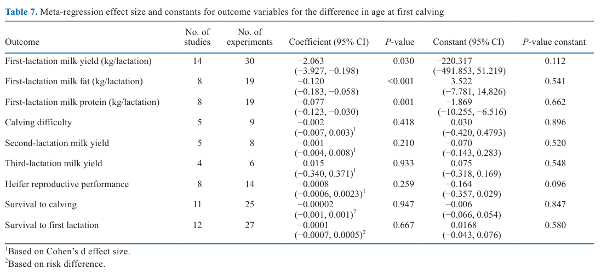

---
# YAML FRONTMATTER (обязательно)
id: CS.SOTA.387
type: sota
format_version: v1.1
knowledge_tier: P1
domain: cattle-science
area: reproduction
subarea: heifer-rearing
subarea2: age-at-first-calving
category: meta-analysis
year: 2026
authors: "Lean, A. K. G., Gunn, A. J., Quinn, J. C., Lean, I. J., Breinhild, K., and Golder, H. M."
title: "Meta-analysis of the effects of age at first calving on production outcomes, calving difficulty, and reproduction in dairy heifers"
journal: "Journal of Dairy Science"
volume: "109"
issue: "6"
pages: "6329-6350"
doi: "10.3168/jds.2025-27004"
publisher: "Elsevier / ADSA"
open_access: true
license: "CC BY"
language: ru
freshness_window: "2026-08-05 — 2028-08-05"
sota_edition: "1.0"
derivation:
  - source: "Lean et al., 2026, Journal of Dairy Science (109:6)"
    type: "ConservativeRetextualization (FPF A.6.3)"
    reopen_trigger: "DOI: 10.3168/jds.2025-27004"
tags:
  - age-at-first-calving
  - meta-analysis
  - dairy-heifer
  - first-lactation-milk-yield
  - calving-difficulty
  - heifer-reproduction
  - survival
  - holstein
related:
  - id: CS.SOTA.149
    type: extends
    note: "Hutchison et al. (2017) — геномная оценка AFC; ретроспективные данные, которые данный мета-анализ дополняет проспективными экспериментами"
    relevance: high
  - id: CS.SOTA.XXX
    type: foundational
    note: "NASEM 2021 — энергетические и белковые потребности растущих телок, нормы ADG"
    relevance: high
---

# CS.SOTA.387: Lean et al. (2026) — Мета-анализ влияния возраста первого отёла на продуктивность, трудность отёла и репродукцию молочных телок

> **Навигация:** [2. Аннотация](#2-аннотация-abstract) · [3. Введение](#3-введение) · [4. Методология](#4-методология) · [5. Результаты](#5-результаты) · [6. Интерпретация](#6-интерпретация-и-обсуждение) · [7. Критический анализ](#7-критический-анализ) · [8. Выводы](#8-выводы) · [9. FAQ](#9-faq) · [10. Практика](#10-практическое-применение) · [12. Источники](#12-источники)

---

# 2. АННОТАЦИЯ (Abstract)

## 2.1. Перевод Abstract

Цель исследования — определить методами мета-анализа, как стратегии кормления, содержания и репродукции, направленные на снижение возраста первого отёла (age at first calving, AFC), влияют на продуктивность и репродуктивные показатели. Поиск литературы проводился по трём поисковым системам для выявления проспективных исследований, оценивавших AFC. Критерии включения: специфические молочные породы, обработанная группа с AFC ниже 26 месяцев и проспективное включение телок. Подходящих проспективных исследований оказалось немного: 16 исследований, содержащих 35 экспериментов. Выявлена существенная гетерогенность, вероятно обусловленная различиями в дизайне исследований и интервенциях, создававших разницу в AFC. Исходы оценивались классическими многоуровневыми мета-аналитическими моделями со случайными эффектами со стандартизованной разностью средних (standard mean difference, SMD), размерами эффекта (effect size, ES) или разностями рисков (risk difference) где уместно. Мета-регрессия выполнялась по разнице AFC. У телок, отелившихся раньше сверстниц, выявлены потери продукции первой лактации: молоко (−2,06 л/день на каждый день более раннего отёла), жир (−0,12 кг/день) и белок (−0,08 кг/день). Различий по надоям второй и третьей лактаций, трудности отёла, репродуктивной продуктивности телок, выживаемости до отёла и до конца первой лактации не обнаружено. Хотя продуктивность первой лактации снижается, это может компенсироваться меньшим числом дней до первого отёла без ущерба для способности телок отелиться, забеременеть впервые или дожить до конца первой лактации. Учитывая дефицит проспективных исследований, необходимы дополнительные рандомизированные контролируемые эксперименты на протяжении нескольких лактаций с данными о здоровье, продуктивности и репродукции (Lean et al., 2026, p. 6329).

## 2.2. Key Claims

**Claim 1: Снижение AFC уменьшает надой первой лактации — дозозависимо.**
- **Утверждение:** Каждый день более раннего отёла «стоит» 2,06 ± 0,95 л молока за первую лактацию (мета-регрессия по разнице AFC); суммарный SMD = −430,1 кг/лактацию (95% CI −819,4…−40,9; P = 0,030). Тёлка, отелившаяся на 100 дней раньше, теряет ~206 л молока за первую лактацию.
- **Evidence:** Многоуровневая модель случайных эффектов DerSimonian–Laird, 14 исследований / 30 экспериментов; мета-регрессия по разнице AFC.
- **Уверенность:** 0.78 (значимый эффект в многоуровневой модели и мета-регрессии, согласие с ретроспективной литературой; ограничение — экстремальная гетерогенность I² = 100 %).
- **Цитата:** "When meta-regression was performed for the effect of age difference at first calving, there was a loss of 2.06 ± 0.95 L in milk per day earlier a heifer calves (P < 0.001; Table 7)." (Lean et al., 2026, p. 6340)

**Claim 2: Жир и белок молока первой лактации также снижаются при раннем отёле.**
- **Утверждение:** SMD жира −17,5 кг/лактацию (P = 0,017) и белка −14,7 кг/лактацию (P = 0,009); мета-регрессия: −0,120 кг/день жира (P < 0,001) и −0,077 кг/день белка (P = 0,001) на каждый день более раннего отёла; тёлка на 100 дней моложе — минус 12 кг жира и 8 кг белка за первую лактацию.
- **Evidence:** 8 исследований / 19 экспериментов для обоих исходов; ADG в период интервенции — конфаундер, уменьшающий оценку потерь.
- **Уверенность:** 0.72 (значимые эффекты, но меньше экспериментов и конфаундинг ADG, встроенного в дизайн интервенций).
- **Цитата:** "Milk fat was decreased by 0.12 ± 0.032 kg/d in a heifer that calved at a younger age, while milk protein was decreased by 0.08 ± 0.028 kg/d as AFC decreased." (Lean et al., 2026, p. 6340)

**Claim 3: Надои второй и третьей лактаций не различаются между группами AFC.**
- **Утверждение:** SLMY: ES = 0,08 (95% CI −0,42…0,57; P = 0,760; 5 исследований / 8 экспериментов); TLMY: ES = 0,05 (95% CI −0,59…0,50; P = 0,864; 4 исследования / 6 экспериментов); гетерогенность нулевая (I² = 0).
- **Evidence:** Многоуровневые модели случайных эффектов; однородные данные (H² = 1).
- **Уверенность:** 0.55 (эффект отсутствует, но мало экспериментов, малая мощность; возможна компенсация потерь в поздних лактациях — не проверено).
- **Цитата:** "Lower FLMY was not reflected through to second and TLMY (P > 0.05; Table 5 and Figures 7 and 8, respectively)." (Lean et al., 2026, p. 6340)

**Claim 4: Ранний отёл не увеличивает трудность отёла и не ухудшает репродукцию телок.**
- **Утверждение:** Трудность отёла: ES = −0,121 (95% CI −0,450…0,210; P = 0,469; 5 исследований / 9 экспериментов). Репродуктивная продуктивность телок: ES = −0,032 (95% CI −0,308…0,244; P = 0,818; 8 исследований / 14 экспериментов); подгруппы: процент стельных P = 0,74, осеменений на стельность P = 0,19.
- **Evidence:** Многоуровневые модели; I² = 0 для обоих исходов (высокая однородность).
- **Уверенность:** 0.70 (однородные проспективные данные; но мало экспериментов, а худшие исходы отёла в Hoffman et al. (1996)-2 связаны с задержкой зачатия и BCS 3,7/5, а не с возрастом самим по себе).
- **Цитата:** "From our results, a younger AFC does not increase the risk of calving difficulties." (Lean et al., 2026, p. 6347)

**Claim 5: Выживаемость до отёла и до конца первой лактации не зависит от AFC.**
- **Утверждение:** Разность рисков выживаемости до отёла −0,01 (95% CI −0,20…0,19; P = 0,954; 11 исследований / 25 экспериментов) и до конца первой лактации +0,01 (95% CI −0,17…0,20; P = 0,905; 12 исследований / 27 экспериментов) — практически идентичная выживаемость.
- **Evidence:** Многоуровневые модели разности рисков; I² = 0.
- **Уверенность:** 0.75 (наибольшее число экспериментов среди непродукционных исходов, нулевая гетерогенность; ограничение — нет данных за пределами первой лактации).
- **Цитата:** "This means survival to the end of the first lactation was nearly identical regardless of AFC." (Lean et al., 2026, p. 6342)

---

# 3. ВВЕДЕНИЕ

## 3.1. Контекст и значимость проблемы

Снижение возраста первого отёла (AFC) молочных телок давно рассматривается как способ повышения продуктивности молочной отрасли. Традиционно в пастбищных системах отёл приурочивали к весеннему пику травы с целевым AFC 24 месяца (Berry and Cromie, 2009). За последние 60 лет переход к стойловому содержанию и круглогодичным отёлам стимулировал интенсивное выращивание телок с повышенными среднесуточными привесами (average daily gain, ADG), что снизило AFC (Swanson, 1961). Цели снижения AFC: более ранняя окупаемость инвестиций (Hutchison et al., 2017), рост долголетия (Han et al., 2022), снижение выбросов парниковых газов (Dall-Orsoletta et al., 2019), сокращение интервала между поколениями, улучшение репродукции (Lin et al., 1986) и рост пожизненного надоя (Krpálková et al., 2014). Потенциальные риски: рост дистоции (Erb et al., 1985), синдром «жирного вымени» (fatty udder syndrome; Sejrsen et al., 2000), снижение продуктивности первой лактации (Lin et al., 1986) и рост мертворождений (Ettema and Santos, 2004; Hutchison et al., 2017). Отраслевая тенденция — к более раннему AFC: в США доля телок Holstein, телившихся в 22 месяца, выросла в 4 раза по сравнению с 1997 годом (Hutchison et al., 2017) (Lean et al., 2026, p. 6329).

## 3.2. Обзор литературы (краткий)

1. **Zanton and Heinrichs (2005)** — предыдущий мета-анализ: допubertальные привесы 836 г/д оптимальны для надоя первой лактации; есть предел тому, насколько рано тёлка может отелиться без потерь.
2. **Lin et al. (1986, 1988); Curran et al. (2013); Heinrichs et al. (2017); Hutchison et al. (2017); Eastham et al. (2018)** — рекомендации по минимальному целевому AFC варьируют от 20,5–22 до 26 месяцев (Froidmont et al., 2013; Turiello et al., 2020).
3. **Ettema and Santos (2004); Nilforooshan and Edriss (2004); Mohd Nor et al. (2013)** — ретроспективные анализы: снижение FLMY у молодых первотёлок.
4. **Krpálková et al. (2014)** — при ADG >0,950 кг/д до отёла продуктивность во 2-й и 3-й лактациях выше, чем у более поздно телившихся сверстниц.
5. **Методологическая проблема:** большинство данных по AFC — ретроспективные, что вносит смещение и конфаундинг (случайные ранние покрытия, поздние отёлы из-за болезней) — отсюда ценность мета-анализа именно проспективных экспериментов (Lean et al., 2026, p. 6330).

## 3.3. Гипотеза и цель исследования

**Гипотеза:** Стратегии кормления, содержания и осеменения, снижающие AFC, уменьшат объём молока, жира и белка в первой лактации, но не окажут негативного влияния на лёгкость первого отёла и репродуктивную продуктивность; надои поздних лактаций затронуты не будут (Lean et al., 2026, p. 6330).

**Primary outcomes:** FLMY, жир и белок молока первой лактации.
**Secondary outcomes:** SLMY, TLMY, трудность отёла (шкала 1–5), репродуктивная продуктивность телок, выживаемость до отёла и до конца первой лактации.

---

# 4. МЕТОДОЛОГИЯ

## 4.1. Дизайн исследования

| Параметр | Описание |
|----------|----------|
| **Тип исследования** | Систематический обзор и мета-анализ проспективных экспериментов по PRISMA (Page et al., 2021) |
| **Поиск** | SCOPUS, Google Scholar, ISI Web of Science; первичный поиск 9–14 ноября 2023, дополнительный — 8 ноября 2024 |
| **Возвращено записей** | 2023: WoS 1 539, Google Scholar 19 700 (оценено 710), SCOPUS 823; 2024: 179, 3 280 (170), 81 соответственно |
| **Скрининг** | 711 документов по абстрактам → 128 полных текстов → финально 16 исследований / 35 экспериментов (Table 1) |
| **Критерии исключения** | Bos indicus, мясной скот, ретроспективные исследования/включение, отсутствие группы с AFC <26 мес, статьи старше 40 лет, не peer-reviewed, нерандомизированные, неанглоязычные |
| **Причины исключения полных текстов** | Ретроспективный анализ/включение (68), статья не на английском (18), off-topic (10), нет группы AFC <26 мес (4), нерандомизированный дизайн (5), только абстракт (3), обзор (3), дубликат (1) |
| **Извлечение данных** | Excel (Microsoft 365), проверка тремя авторами; данные из графиков — WebPlotDigitizer |
| **Статистика** | Stata 18: SMD (esize(mdiff)) для FLMY/жира/белка; ES Коэна (esize(cohend)) для трудности отёла, репродукции, SLMY/TLMY; разность рисков (esize(rdiff)) для выживаемости; многоуровневая модель meta multilevel (эксперименты вложены в исследования); случайные эффекты DerSimonian–Laird |
| **Гетерогенность** | χ² (Q) при α = 0,1; I² (Higgins–Thompson), τ², H²; пороги: 50–90 % — существенная, 75–100 % — значительная |
| **Мета-регрессия** | По разнице AFC (meta regress); конфаундеры: масса при отёле, псевдорепликация, ADG в период интервенции; критерий конфаундинга — изменение коэффициента >25 % (Rothman, 1986) |
| **Смещение публикаций** | Funnel plots; тест Эггера — малый-сэмпл bias не выявлен; leave-one-out — ни один эксперимент не конфаундировал результаты |
| **Риск смещения** | По Winder et al. (2019): отсутствие ослепления во всех исследованиях; оценён как присутствующий, но маловлияющий |

## 4.2. Характеристика включённых экспериментов

- **Интервенции (категории):** управление привесами через кормление (n = 12), возраст первого осеменения (n = 1), доотъёмное кормление телят (n = 8), комбинация возраста осеменения и кормления (n = 14) (Lean et al., 2026, p. 6339).
- **Размер:** от 10 до 502 телок на эксперимент; два крупнейших (>180 телок/группу) — из 1980-х.
- **Породы:** преимущественно Holstein; одно исследование с Holstein, Ayrshire и кроссами (Lin et al., 1986, 1988); единственное пастбищное исследование (Dobos et al., 2001, 2004) дало 8 экспериментов.
- **AFC:** обработанные группы 618–918 дней, контроль 684–1 084 дня; разница AFC 6–360 дней, средняя 108 дней по 35 экспериментам (Lean et al., 2026, p. 6339).
- **Свежесть данных:** только одно подходящее исследование за последние 10 лет (Prado et al., 2021) (Lean et al., 2026, p. 6342).

## 4.3. Медиа-инвентарь

| ID | Тип | Описание | Файл | Статус |
|----|-----|----------|------|--------|
| Table 4 | Таблица | SMD и гетерогенность для продуктивности первой лактации (FLMY, жир, белок) | `table-4-first-lactation-smd.png` | ✅ Встроено |
| Table 5 | Таблица | Размеры эффекта: трудность отёла, SLMY, TLMY, репродукция телок | `table-5-effect-sizes.png` | ✅ Встроено |
| Table 6 | Таблица | Разность рисков выживаемости (до отёла, до конца первой лактации) | `table-6-survival-risk.png` | ✅ Встроено |
| Table 7 | Таблица | Мета-регрессия по разнице AFC для всех исходов | `table-7-meta-regression.png` | ✅ Встроено |
| Figure 2 | Лесной график | SMD FLMY по экспериментам (30 экспериментов, упорядочены по AFC обработанной группы) | `figure-2-forest-flmy.png` | ✅ Встроено |
| Table 1 | Таблица | Описательные характеристики 35 экспериментов | — | ⏭️ Пропущено (пересказ в разделе 4.2; таблица >30 строк) |
| Table 2 | Таблица | Сырые средние продукционных показателей по экспериментам | — | ⏭️ Пропущено (пересказ по ключевым значениям; таблица >30 строк) |
| Table 3 | Таблица | Сырые средние трудности отёла, репродукции, выживаемости | — | ⏭️ Пропущено (пересказ; ключевые значения Hoffman et al. приведены в тексте) |
| Figures 3–10, 11–13 | Графики | Лесные графики остальных исходов; пузырьковые графики мета-регрессии | — | ⏭️ Пропущено (значения из Table 4–7 продублированы в тексте) |

---

# 5. РЕЗУЛЬТАТЫ

## 5.1. Продуктивность первой лактации: молоко, жир, белок

**Соответствует:** Table 4

*Источник: Lean et al., 2026, p. 6336 (Table 4).*

**Описание:**
В модели Lean et al. (2026) ранний отёл (обработанные группы) достоверно снижал продуктивность первой лактации относительно позднего контроля: FLMY SMD = −430,119 кг/лактацию (95% CI −819,356…−40,881; P = 0,030; 14 исследований / 30 экспериментов); жир SMD = −17,507 кг (95% CI −31,856…−3,158; P = 0,017; 8 исследований / 19 экспериментов); белок SMD = −14,740 кг (95% CI −25,837…−3,643; P = 0,009; 8 исследований / 19 экспериментов). Гетерогенность экстремальная: I² = 100 % (FLMY), 98 % (жир), 97 % (белок), что отражает различия дизайнов и интервенций (Lean et al., 2026, p. 6336, 6340).

**Механистическая интерпретация:**
Снижение продукции у молодых первотёлок объясняется продолжающимся ростом и развитием тела: питательные вещества распределяются между синтезом молока и приростом собственной массы. Дополнительный механизм из литературы — при допubertальных привесах >800 г/д возможно избыточное отложение жира в вымени, снижающее секреторный потенциал (Dobos et al., 2000; Sejrsen et al., 2000; Zanton and Heinrichs, 2005); при адекватном белке рациона этот эффект может не реализовываться (Capuco et al., 1995) (Lean et al., 2026, p. 6345–6346).

**Ключевые цифры:**
- FLMY: −430,1 кг/лактацию (P = 0,030), I² = 100 %, τ² = 639 572, H² = 1 812
- Жир: −17,5 кг/лактацию (P = 0,017), I² = 98 %
- Белок: −14,7 кг/лактацию (P = 0,009), I² = 97 %

## 5.2. Лесной график FLMY

**Соответствует:** Figure 2

*Источник: Lean et al., 2026, p. 6338 (Figure 2).*

**Описание:**
Из 30 экспериментов по FLMY большинство точечных оценок лежит левее нуля (в пользу позднего контроля); итоговый ромб многоуровневой модели: −430,12 кг (95% CI −819,36…−40,88), z = −2,17, P = 0,030. Наибольшие отрицательные эффекты — у Ishii et al. (2011)-1 (−2 643 кг) и Le Cozler et al. (2009)-2 (−1 895 кг); отдельные эксперименты (Raeth-Knight et al. (2009)-3, Terré et al. (2009)) показывали положительные эффекты раннего отёла, что и формирует экстремальную гетерогенность (Q(29) = 29 572, P < 0,001) (Lean et al., 2026, p. 6338).

## 5.3. Непродукционные исходы: трудность отёла, поздние лактации, репродукция

**Соответствует:** Table 5

*Источник: Lean et al., 2026, p. 6337 (Table 5).*

**Описание:**
Все четыре исхода незначимы и полностью однородны (I² = 0, H² = 1): трудность отёла ES = −0,121 (95% CI −0,450…0,210; P = 0,469; 5 исследований / 9 экспериментов); SLMY ES = 0,08 (95% CI −0,42…0,57; P = 0,760); TLMY ES = 0,05 (95% CI −0,59…0,50; P = 0,864); репродуктивная продуктивность телок ES = −0,032 (95% CI −0,308…0,244; P = 0,818; 8 исследований / 14 экспериментов). Подгрупповой анализ репродукции: процент стельных P = 0,74; осеменений на стельность P = 0,19 (Lean et al., 2026, p. 6337, 6341–6342).

**Механистическая интерпретация:**
Отсутствие роста дистоции при раннем отёле противоречит части ретроспективной литературы (Erb et al., 1985), но согласуется с Hutchison et al. (2017), где группы 18–20 и 22 месяца имели даже лучшую лёгкость отёла, чем 24-месячные. Поэкспериментальный разбор: 6 экспериментов склонялись к лучшей лёгкости отёла у молодых, 3 — к худшей; худший результат (Hoffman et al. (1996)-2) получен у телок с ускоренным ростом, но задержанным зачатием и высшим BCS при отёле (3,7 из 5) — то есть проблема была в ожирении при задержке стельности, а не в возрасте как таковом (Lean et al., 2026, p. 6347).

## 5.4. Выживаемость

**Соответствует:** Table 6

*Источник: Lean et al., 2026, p. 6337 (Table 6).*

**Описание:**
Выживаемость до отёла: разность рисков −0,01 (95% CI −0,20…0,19; P = 0,954; 11 исследований / 25 экспериментов). Выживаемость до конца первой лактации: +0,01 (95% CI −0,17…0,20; P = 0,905; 12 исследований / 27 экспериментов). Разность рисков близка к нулю — выживаемость практически идентична независимо от AFC (Lean et al., 2026, p. 6342). Данных за пределами первой лактации недостаточно; только Gardner et al. (1988) отслеживал животных на протяжении жизни (Lean et al., 2026, p. 6347).

## 5.5. Мета-регрессия по разнице AFC

**Соответствует:** Table 7

*Источник: Lean et al., 2026, p. 6346 (Table 7).*

**Описание:**
Коэффициенты мета-регрессии (на каждый день уменьшения AFC): FLMY −2,063 л (95% CI −3,927…−0,198; P = 0,030); жир −0,120 кг (95% CI −0,183…−0,058; P < 0,001); белок −0,077 кг (95% CI −0,123…−0,030; P = 0,001). Практическая трансляция авторов: тёлка, отелившаяся на 100 дней раньше, произведёт за первую лактацию на 206 л молока, 12 кг жира и 8 кг белка меньше (Lean et al., 2026, p. 6341). Для непродукционных исходов коэффициенты незначимы (P = 0,210–0,947). Масса при отёле не была конфаундером продукционных исходов; ADG в период интервенции — конфаундер для жира и белка, уменьшавший оценку потерь, что затрудняет отделение физиологического эффекта от эффекта дизайна (Lean et al., 2026, p. 6341, 6346).

---

# 6. ИНТЕРПРЕТАЦИЯ И ОБСУЖДЕНИЕ

## 6.1. Связь с гипотезой

Гипотеза подтверждена полностью по всем трём компонентам: (1) надой, жир и белок первой лактации снижены при раннем отёле; (2) трудность отёла и репродукция телок не ухудшены; (3) надои второй и третьей лактаций не различаются (Lean et al., 2026, p. 6348).

## 6.2. Сравнение с литературой

| Исследование | Согласие/Противоречие/Расширение |
|--------------|----------------------------------|
| Ettema and Santos (2004); Nilforooshan and Edriss (2004); Mohd Nor et al. (2013) | **Согласуется** — FLMY снижается у молодых первотёлок |
| Krpálková et al. (2014); Hutchison et al. (2017) | **Согласуется** — сопоставимая продуктивность в последующих лактациях |
| Zanton and Heinrichs (2005) | **Расширяет** — там оптимум допubertального ADG 836 г/д; здесь — дозозависимая цена раннего отёла в литрах/день AFC |
| Erb et al. (1985) | **Противоречит** — там рост дистоции при раннем отёле; здесь различий нет (P = 0,469) |
| Hutchison et al. (2017) | **Согласуется частично** — там лучшая лёгкость отёла у 18–22 мес, но ускоренное падение FLMY при AFC <21 мес; здесь экспериментов с AFC <21 мес недостаточно для проверки |
| Sherwin et al. (2016) | **Противоречит** — там рост риска выбытия при AFC >30 мес (437 стад Великобритании); здесь трендов по выживаемости не выявлено |

## 6.3. Механистические выводы

1. **Конкуренция роста и лактации:** потери молока, жира и белка в первой лактации отражают продолжающийся рост тела молодых первотёлок; масса при отёле как ковариата конфаундером не была (Lean et al., 2026, p. 6345).
2. **Жирное вымя как гипотеза, не факт:** снижение продукции связывают с отложением жира в вымени при допubertальных привесах >800 г/д, но при достатке белка рациона эффект может отсутствовать; данных по белку рациона в датасете не хватило для проверки (Lean et al., 2026, p. 6346).
3. **Дистоция — функция кондиции, а не возраста:** худшие исходы отёла в датасете связаны с задержкой зачатия и BCS 3,7/5 (Hoffman et al., 1996), а не с молодым AFC самим по себе (Lean et al., 2026, p. 6347).
4. **Экономика решает:** потери первой лактации компенсируются меньшим временем выращивания и меньшим числом непродуктивных животных; рекомендации по оптимальному AFC смещаются с 23–25 мес (только первая лактация) к 21–24 мес при учёте пожизненного надоя (Lean et al., 2026, p. 6348).

---

# 7. КРИТИЧЕСКИЙ АНАЛИЗ

## 7.1. Сильные стороны

- **Только проспективные эксперименты** — ключевое отличие от ретроспективной литературы по AFC, где причина раннего/позднего отёла сама смещает исходы (Lean et al., 2026, p. 6330).
- **Строгий PRISMA-протокол** с двойным независимым скринингом и третьим арбитром; полный учёт причин исключения (Lean et al., 2026, p. 6330).
- **Многоуровневые модели** (эксперименты вложены в исследования) — корректная обработка кластерной структуры 35 экспериментов из 16 исследований.
- **Мета-регрессия по разнице AFC** — переводит категориальный вопрос «рано vs поздно» в дозозависимую метрику (литры на день AFC), пригодную для экономических расчётов.
- **Полная батарея диагностики:** funnel plots, тест Эггера, leave-one-out, анализ конфаундеров (>25 % изменение коэффициента), оценка риска смещения по Winder et al. (2019).

## 7.2. Ограничения

**Внутренние:**
- **Экстремальная гетерогенность продукционных исходов** (I² = 97–100 %) — пулled-оценки FLMY/жира/белка интерпретируемы лишь как усреднение сильно разнородных экспериментов (Lean et al., 2026, p. 6343).
- **Устаревший корпус данных:** только одно исследование за последние 10 лет; два крупнейших — из 1980-х; перенос на современную генетику и кормление ограничен (Lean et al., 2026, p. 6342).
- **Мало экспериментов для поздних лактаций** (SLMY: 8; TLMY: 6) — нулевые эффекты могут быть следствием малой мощности.
- **Конфаундинг ADG:** привесы были инструментом создания разницы AFC, поэтому эффект возраста неотделим от эффекта скорости роста (Lean et al., 2026, p. 6346).
- **Не оценены:** жир/белок 2–3-й лактаций, репродукция после отёла, пожизненная выживаемость, здоровье, мертворождения, BCS при отёле (недостаток данных) (Lean et al., 2026, p. 6336, 6342).
- **Отсутствие ослепления** во всех включённых исследованиях (Lean et al., 2026, p. 6337).

**Внешние:**
- **Только Holstein (и одно исследование с Ayrshire):** рекомендации не распространяются на Jersey и Brown Swiss, для которых есть лишь ретроспективные данные (Sherwin et al., 2016; Hutchison et al., 2017) (Lean et al., 2026, p. 6342–6343).
- **Нижняя граница AFC не определена:** младшая средняя группа — 618 дней (20,6 мес), единственная ниже 21 мес; оптимум AFC моделью не вычислим (Lean et al., 2026, p. 6348).

## 7.3. Применимость к российским условиям

- **Целевой AFC 22–24 мес для Holstein** — основная порода молочного скота РФ; проспективные данные подтверждают безопасность этого диапазона по отёлу, репродукции и выживаемости.
- **Дозозависимая цена раннего отёла (−2,06 л/день AFC)** применима для экономических расчётов в российских хозяйствах: сравнение стоимости дополнительных дней выращивания с потерей ~206 л первой лактации на каждые 100 дней ускорения.
- **Контроль кондиции при отёле** критичен в условиях интенсивного выращивания: риск дистоции связан с BCS >3,5 при задержке зачатия, а не с возрастом — мониторинг BCS телок дешевле, чем сдвиг целевого AFC [интерполяция из Hoffman et al., 1996 в датасете статьи].
- **Пастбищные и смешанные системы** (часть регионов РФ) представлены в мета-анализе слабо (одно пастбищное исследование, 8 экспериментов) — осторожность при переносе [guess: эффекты могут отличаться при сезонном кормлении].

---

# 8. ВЫВОДЫ

## 8.1. Ключевые выводы автора (перевод)

Снижение AFC приводило к небольшому уменьшению надоя, жира и белка первой лактации; различий по репродуктивной продуктивности телок, трудности отёла, продуктивности второй и третьей лактаций и выживаемости не выявлено. Необходимы дополнительные проспективные исследования, особенно на более молодых телках (Lean et al., 2026, p. 6348).

## 8.2. Ключевые выводы (структурировано)

1. **Ранний отёл стоит молока:** −2,06 л, −0,12 кг жира и −0,08 кг белка первой лактации на каждый день уменьшения AFC (дозозависимо).
2. **Потери локализованы в первой лактации:** вторая и третья лактации не различаются (ES ≈ 0, I² = 0).
3. **Ранний отёл безопасен:** нет роста дистоции, ухудшения репродукции телок и снижения выживаемости до отёла и до конца первой лактации.
4. **Оптимум AFC не установлен:** данных по группам моложе 21 мес недостаточно; решение экономическое — цена потерянного молока vs цена дней выращивания.
5. **Поле исследований пустое:** за 10 лет — одно подходящее проспективное исследование; нужны РКИ на современных животных за несколько лактаций.

## 8.3. Ключевые сообщения для лекции

1. Мета-анализ проспективных экспериментов отделяет эффект AFC от смещений ретроспективных данных: ранний отёл уменьшает первую лактацию, но не вредит отёлу, репродукции и выживаемости.
2. Дозозависимость: 100 дней ускорения отёла ≈ 206 л молока, 12 кг жира, 8 кг белка — готовый коэффициент для экономической модели выращивания ремёнта.
3. Дистоция при раннем отёле — проблема кондиции (BCS), а не возраста: контролируйте упитанность телок при задержке зачатия.
4. Нулевая гетерогенность непродукционных исходов (I² = 0) против экстремальной гетерогенности продукционных (I² ≈ 100 %) — показательный пример чтения I² в мета-анализе.
5. Пробел доказательств: современных РКИ по AFC практически нет — рекомендации отрасли опираются на данные 30–40-летней давности.

---

# 9. FAQ

**Вопрос 1: Насколько снижается надой первой лактации при более раннем отёле?**
Ответ: Дозозависимо: −2,06 ± 0,95 л молока на каждый день уменьшения AFC (мета-регрессия, P = 0,030 по Table 7). Суммарный SMD = −430 кг/лактацию (P = 0,030). Тёлка, отелившаяся на 100 дней раньше, теряет ~206 л молока, 12 кг жира и 8 кг белка за первую лактацию (Lean et al., 2026, p. 6340–6341).

**Вопрос 2: Компенсируются ли потери первой лактации в последующих?**
Ответ: Во второй и третьей лактациях различий по надою не выявлено (P = 0,760 и 0,864 соответственно, I² = 0), то есть потери не нарастают. Однако экспериментов мало (8 и 6), и прямой компенсации (догоняющего надоя) данные не показывают; Krpálková et al. (2014) сообщали даже о более высокой продуктивности в поздних лактациях при ADG >0,950 кг/д, но это не проверено в данном датасете (Lean et al., 2026, p. 6340, 6344).

**Вопрос 3: Повышает ли ранний отёл риск трудного отёла?**
Ответ: Нет. Размер эффекта трудности отёла −0,121 (P = 0,469; 9 экспериментов; I² = 0). Худшие исходы в датасете связаны не с возрастом, а с задержкой зачатия при ускоренном росте и высокой кондицией при отёле (BCS 3,7/5 в Hoffman et al., 1996). Вывод авторов: более молодой AFC не увеличивает риск дистоции (Lean et al., 2026, p. 6347).

**Вопрос 4: Какой оптимальный AFC рекомендует статья?**
Ответ: Прямой рекомендации нет — модель не позволяет вычислить оптимум из-за нехватки экспериментов с AFC <21 мес (младшая группа 618 д ≈ 20,6 мес). В литературе: 23–25 мес при оценке только первой лактации, 21–24 мес при учёте пожизненной продуктивности. Оптимум для хозяйства определяется экономикой: затраты на ускоренное выращивание + потерянная первая лактация vs выигрыш от сокращения непродуктивного периода (Lean et al., 2026, p. 6348).

**Вопрос 5: Почему гетерогенность такая высокая и не обесценивает ли это выводы?**
Ответ: I² = 97–100 % для продукционных исходов отражает разнородность интервенций (12 кормовых, 8 доотъёмных, 14 комбинированных схем), систем содержания и диапазона разниц AFC (6–360 дней). Авторы смягчают это многоуровневыми моделями случайных эффектов, мета-регрессией и диагностикой влияния (leave-one-out). Для непродукционных исходов гетерогенность нулевая (I² = 0), что делает выводы о безопасности раннего отёла более устойчивыми, чем точную величину потерь молока (Lean et al., 2026, p. 6336–6337, 6343).

---

# 10. ПРАКТИЧЕСКОЕ ПРИМЕНЕНИЕ

## 10.1. Алгоритм решения по целевому AFC

1. **Задать целевой диапазон AFC 22–24 мес** для Holstein: проспективные данные не выявляют рисков по отёлу, репродукции и выживаемости в этом диапазоне (20 экспериментов с AFC <24 мес).
2. **Оценить экономику ускорения:** каждые 100 дней ускорения ≈ −206 л первой лактации; сопоставить со стоимостью ~100 дней выращивания (корма, труд, место) и ценой молока.
3. **Контролировать ADG и белок:** избегать допubertальных привесов >800 г/д при дефиците белка рациона (риск жирового перерождения вымени по Zanton and Heinrichs, 2005; смягчается белком по Capuco et al., 1995).
4. **Мониторить BCS при отёле:** не допускать BCS >3,5, особенно у телок с задержкой зачатия — главный управляемый фактор дистоции в датасете.
5. **Не сдвигать AFC ниже 21 мес** без собственного мониторинга: проспективных данных по группам моложе 20,6 мес практически нет, ретроспективно там ускоренное падение FLMY (Hutchison et al., 2017).

## 10.2. Типичные ошибки

- **Перенос ретроспективных выводов без поправки на смещение:** случайные ранние отёлы и поздние отёлы по болезни искажают ассоциации AFC с продуктивностью (Lean et al., 2026, p. 6330).
- **Ускорение роста без контроля кондиции:** задержка зачатия + высокий ADG → BCS 3,7/5 → худшая лёгкость отёла (пример Hoffman et al., 1996).
- **Оценка только первой лактации:** вывод «ранний отёл невыгоден» игнорирует сокращение непродуктивного периода и равные поздние лактации.
- **Игнорирование белка рациона при высоких привесах:** часть потерь молока может быть следствием состава диеты, а не возраста.

## 10.3. Пограничные сценарии

- **AFC <21 мес:** зона недоказанности — проспективных экспериментов почти нет; ретроспективно — ускоренное снижение FLMY и рост мертворождений (не оценено в мета-анализе).
- **Пастбищные системы:** представлены одним исследованием (Dobos et al., 8 экспериментов); сезонная привязка отёла меняет экономику решения.
- **Породы не-Holstein (Jersey, Brown Swiss, айршир):** мета-анализ неприменим напрямую; доступны только ретроспективные данные.
- **Тёлки с задержкой зачатия на интенсивном кормлении:** комбинация, давшая худшие исходы отёла, — снижать энергию рациона при пропуске сроков покрытия.

---

# 11. ИНСТРУМЕНТЫ И ШАБЛОНЫ

## 11.1. Ключевые числовые ориентиры

| Параметр | Значение | Комментарий |
|----------|----------|-------------|
| Цена раннего отёла (молоко) | −2,06 ± 0,95 л/день AFC | Мета-регрессия, P = 0,030 |
| Цена раннего отёла (жир) | −0,120 ± 0,032 кг/день AFC | P < 0,001 |
| Цена раннего отёла (белок) | −0,077 ± 0,028 кг/день AFC | P = 0,001 |
| 100 дней ускорения | −206 л; −12 кг жира; −8 кг белка | За первую лактацию |
| SMD FLMY | −430,1 кг/лактацию (95% CI −819…−41) | P = 0,030; I² = 100 % |
| Трудность отёла | ES = −0,121; P = 0,469; I² = 0 | Различий нет |
| Репродукция телок | ES = −0,032; P = 0,818; I² = 0 | Различий нет |
| Выживаемость до отёла / до конца 1-й лактации | RD = −0,01 / +0,01; P = 0,954 / 0,905 | Различий нет |
| Оптимум допubertального ADG | 836 г/д | Zanton and Heinrichs, 2005 |
| Порог риска жирного вымени | ADG >800 г/д (без контроля белка) | Sejrsen et al., 2000; Dobos et al., 2000 |
| Младшая изученная группа | 618 д (20,6 мес) | Граница доказательности |
| Средняя разница AFC в экспериментах | 108 д (диапазон 6–360) | 35 экспериментов |
| Рекомендации по AFC в литературе | 23–25 мес (1-я лактация); 21–24 мес (пожизненно) | Ettema & Santos 2004; Hutchison 2017 и др. |

## 11.2. Онлайн-ресурсы

- Суплементарные материалы статьи: https://www.doi.org/10.6084/m9.figshare.31856161 (funnel plots и др.) (Lean et al., 2026, p. 6348).

---

# 12. ИСТОЧНИКИ

## 12.1. Первоисточник

Lean, A. K. G., Gunn, A. J., Quinn, J. C., Lean, I. J., Breinhild, K., and Golder, H. M. 2026. Meta-analysis of the effects of age at first calving on production outcomes, calving difficulty, and reproduction in dairy heifers. Journal of Dairy Science 109(6):6329-6350. DOI: 10.3168/jds.2025-27004.

## 12.2. Ключевые статьи (цитированные в работе)

- Zanton, G. I., and A. J. Heinrichs. 2005. Meta-analysis to assess effect of prepubertal average daily gain of Holstein heifers on first-lactation production. J. Dairy Sci. 88:3860–3867. [предыдущий мета-анализ; оптимум ADG 836 г/д]
- Hutchison, J. L., VanRaden, P. M., Null, D. J., Cole, J. B., and Bickhart, D. M. 2017. Genomic evaluation of age at first calving. J. Dairy Sci. 100:6853–6861. [тренд к AFC 22 мес в США; лёгкость отёла; падение FLMY <21 мес]
- Erb, H. N., et al. 1985. Path model of reproductive disorders and performance… J. Dairy Sci. 68:3337–3349. [дистоция при раннем отёле — противоречит]
- Sejrsen, K., et al. 2000. High body weight gain and reduced bovine mammary growth. Domest. Anim. Endocrinol. 19:93–104. [жирное вымя при ADG >800 г/д]
- Krpálková, L., et al. 2014. Effect of prepubertal and postpubertal growth and age at first calving… J. Dairy Sci. 97:3017–3027. [поздние лактации]
- Ettema, J. F., and J. E. Santos. 2004. Impact of age at calving on lactation, reproduction, health, and income… J. Dairy Sci. 87:2730–2742. [мертворождения, экономика]
- Hoffman, P. C., et al. 1996. Effect of accelerated postpubertal growth and early calving… J. Dairy Sci. 79:2024–2031. [задержка зачатия, BCS 3,7/5, дистоция]
- Page, M. J., et al. 2021. The PRISMA 2020 statement. BMJ 372:n71. [методология обзора]
- Winder, C. B., et al. 2019. Completeness of reporting of experiments… J. Dairy Sci. 102:4759–4771. [оценка риска смещения]
- Sherwin, V. E., et al. 2016. The association between age at first calving and survival… Animal 10:1877–1882. [риск выбытия при AFC >30 мес]

## 12.3. Внешние источники [вне статьи]

- NASEM. 2021. Nutrient Requirements of Dairy Cattle. 8th rev. ed. National Academies Press. [foundational reference, не цитируется в Lean et al., 2026 — контекст норм энергии и белка для растущих телок]

---

# 13. ЖУРНАЛ ОБРАБОТКИ

## 13.1. WorkPlan

| Шаг | Действие | Статус |
|-----|----------|--------|
| 1 | Чтение полного текста PDF (22 страницы, постранично fitz) | ✅ |
| 2 | Извлечение метаданных (авторы, DOI 10.3168/jds.2025-27004, стр. 6329–6350) | ✅ |
| 3 | Извлечение медиа (4 таблицы + 1 лесной график, ручной crop fitz @150 dpi) | ✅ |
| 4 | Анализ дизайна (PRISMA, 16 исследований / 35 экспериментов, многоуровневые модели) | ✅ |
| 5 | Выделение Key Claims с оценкой уверенности | ✅ |
| 6 | Описание методологии и корпуса экспериментов | ✅ |
| 7 | Детализация результатов (SMD, ES, RD, мета-регрессия) | ✅ |
| 8 | Критический анализ и применимость к РФ | ✅ |
| 9 | FAQ, практическое применение, числовые ориентиры | ✅ |
| 10 | Формирование YAML frontmatter | ✅ |
| 11 | Сохранение файла | ✅ |

## 13.2. Work Record

| Параметр | Значение |
|----------|----------|
| **Время обработки** | ~45 мин |
| **Строк в файле** | ~430 |
| **Число Key Claims** | 5 |
| **Число источников** | 12 (первоисточник + 10 цитированных + 1 внешний) |
| **Число медиа** | 5 (4 таблицы + 1 фигура) |
| **FPF compliance** | A.7 (разделение модели и реальности), A.6.3 (консервативная переработка), A.10 (якоря доказательств) |
| **Замечания** | (1) В тексте статьи (p. 6340) P мета-регрессии FLMY указан как <0,001, в Table 7 — 0,030; в SoTA приведены оба значения с приоритетом Table 7. (2) Подпись Figure 8 (p. 6343) указывает P = 0,933 для TLMY, тогда как Table 5 — 0,864; использовано значение Table 5. (3) Table 1–3 (>30 строк) и Figures 3–13 не извлечены как PNG — ключевые значения пересказаны в разделах 4.2 и 5 с якорями страниц. |

---

*SoTA создан: 2026-08-05*
